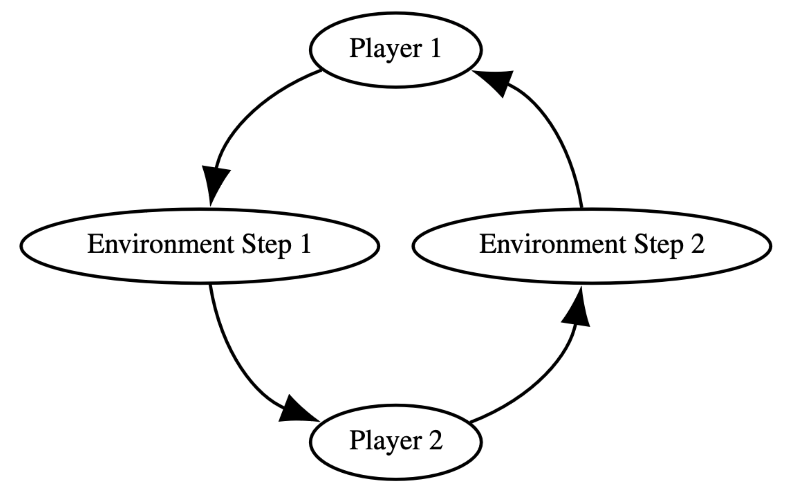

# Multiplayer Atari Games via PettingZoo
This folder contains ported Atari Games made available in [PettingZoo](https://pettingzoo.farama.org/), a multi agent games environment with an API similar to [OpenAI gym](https://gymnasium.farama.org/).

## Installation

Running these Atari games make use of [AtariARI](github.com/mila-iqia/atari-representation-learning.git
) and [PettingZoo](https://pettingzoo.farama.org/environments/atari/boxing/) libraries

### 0. Install pip3

If not already installed(i.e. if pip3 command not found), install pip3:
> sudo apt-get install python3-pip

Then, upgrade pip

>python3 -m pip install --upgrade pip

### 1. Install AtariARI

Successfully run below 2 commands

>pip3 install 'gym[atari]'

>pip3 install git+https://github.com/mila-iqia/atari-representation-learning.git

### 2. Install PettingZoo

Run
>pip3 install 'pettingzoo[atari]

### 3. Install misc libraries

> pip3 install matplotlib

> pip3 install autorom

> AutoROM

## PettingZoo implementation of realtime games

Atari games were suppsosed to appear realtime for humans, but under the hood they are programmed as turn based games with tens of turns per second.

To a human, a game running at full speed still appears realtime.

PettingZoo models these games as [Agent Environment Cycle](https://pettingzoo.farama.org/api/aec/) environments.

At each step, a player(depending on turn) is queried for their next move.

## GameBench implementation of PettingZoo games

Agents are run in background threads. The agent loop is:

1. Get current game state
2. Query agent on what action should be done
3. Store this action in a variable Act

At every turn, we query the stored action Act for that player and execute it.

## Current list of games

1. [Boxing](https://pettingzoo.farama.org/environments/atari/boxing/)