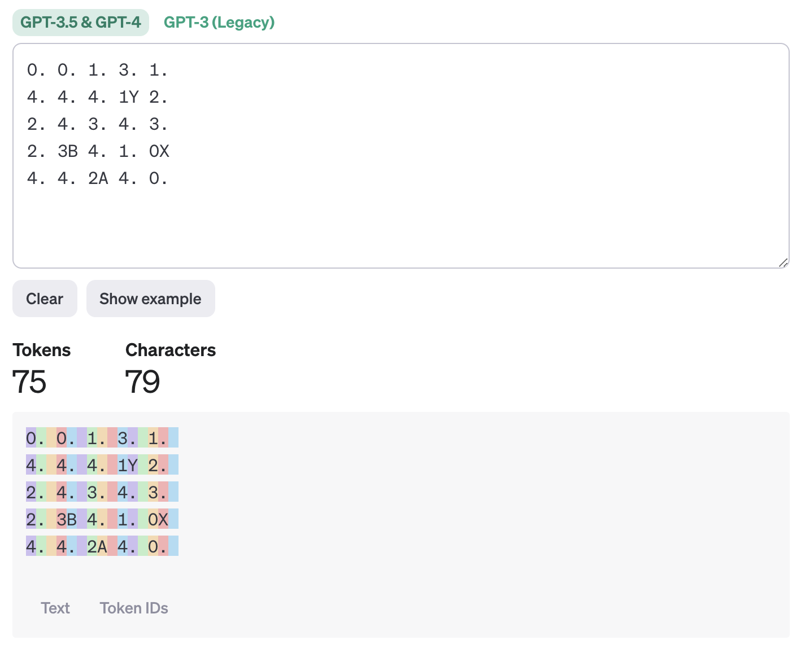

# Santorini

Santorini is a strategy game in which two players take turns moving one of their two pawns on a five by five grid and building blocks on the grid. The game ends when one of the players moves a pawn to a square that has been built three blocks high or when one of the players cannot make a move. Read the full ruleset in [this PDF](./rulebook.pdf).

Note that in this implementation, the pawn that each player moves and builds with alternates on each of the player's turns. The player doesn't choose which pawn to use.

By default, the terminal output board is colored to more easily visualize the pawns and the towers. Player 1's pawns are blue and cyan, and Player 2's pawns are red and magenta. To turn off coloring, set `colored_output` to `False`.

## Board representation

The board is presented to the agents as text in the following format:

```
0. 0. 1. 3. 1.
4. 4. 4. 1Y 2.
2. 4. 3. 4. 3.
2. 3B 4. 1. 0X
4. 4. 2A 4. 0.
```

Each cell of the board is represented by a pair of characters, the first representing the level of the cell (0 to 4) and the second representing any pawns on the cell (`A`, `B`, `X`, or `Y`). If there is no pawn on a cell, the second character is a period.

This representation should be tokenized correctly by GPT-based agents:


